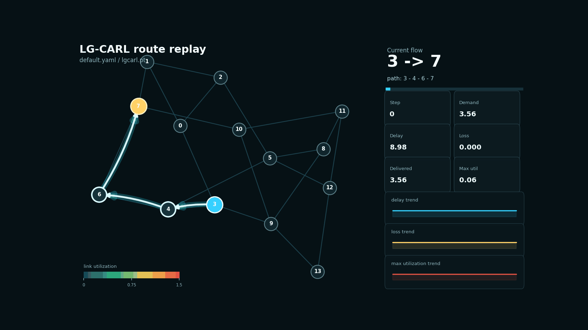
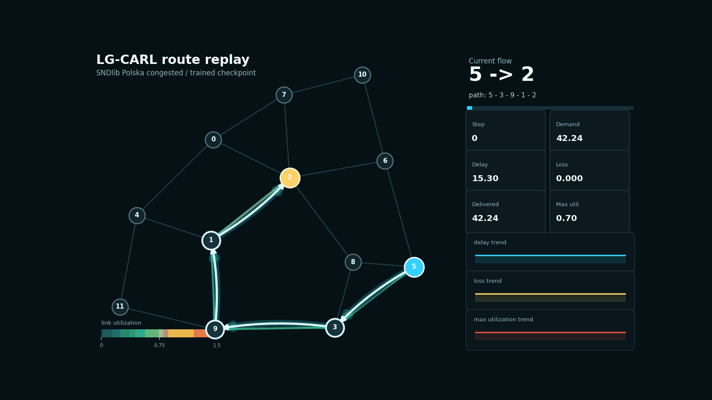
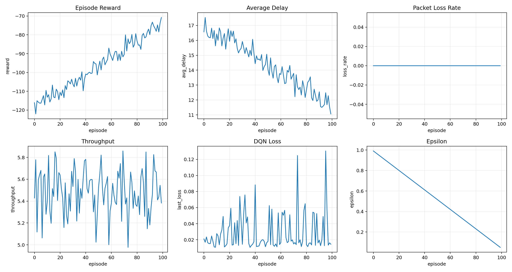
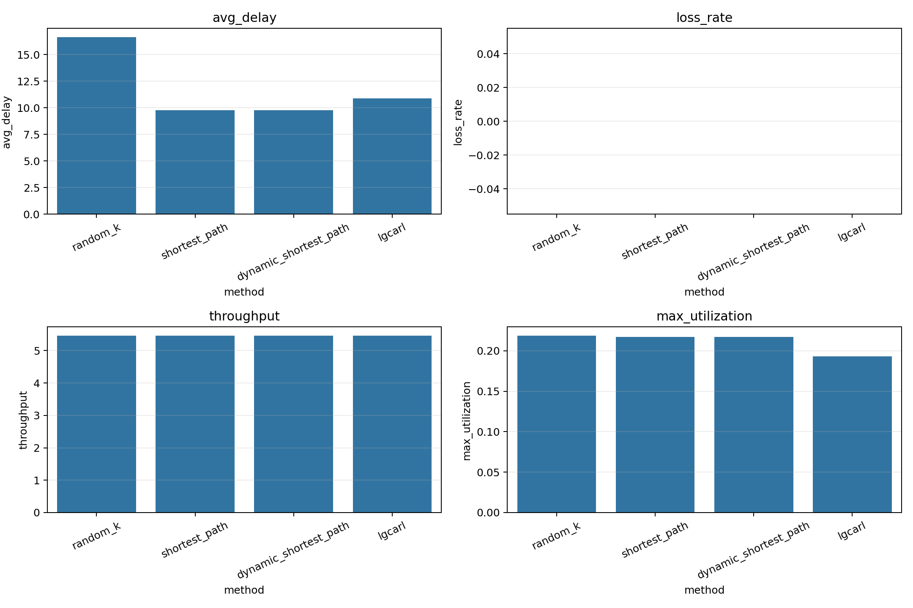

# LG-CARL: Line-Graph Congestion-Aware Reinforcement Learning

> A congestion-aware adaptive routing simulator built with directed line graphs, GraphSAGE, and DQN.


LG-CARL models adaptive network routing as a reinforcement learning problem. Instead of applying a GNN directly to router nodes, it converts the physical topology into a directed line graph, where each directed link becomes a graph node. This makes link-level congestion signals such as utilization, queue length, loss rate, and delay the first-class state representation.

For each traffic demand `(source, destination, bandwidth)`, the environment generates a small set of candidate paths. A DQN agent then scores each candidate path and selects the route with the highest predicted long-term value.

The project includes:

- A lightweight network routing simulator.
- A directed line-graph construction pipeline.
- A GraphSAGE-style link encoder.
- A path-level DQN policy.
- Random, shortest-path, and dynamic-shortest-path baselines.
- Training, evaluation, plotting, and GIF visualization scripts.
- Built-in NSFNet-like and TopoHub/SNDlib topology support.

## Demo

| Normal Traffic | Congested Traffic |
|---|---|
|  |  |
| Most links stay lightly loaded and packet loss remains close to zero. | Multiple links become highly utilized, and both delay and loss start to fluctuate. |

How to read the GIFs:

- Nodes are routers.
- Edges are network links.
- Warmer edge colors indicate higher link utilization.
- The cyan highlighted path is the route selected by LG-CARL for the current flow.
- The right panel reports the current request, demand, delay, loss, delivered traffic, and maximum link utilization.

These GIFs are behavior visualizations. They help explain how the routing policy acts and how congestion evolves, but final performance should still be judged using quantitative metrics.

## Results Snapshot

| Training Curves | Evaluation Summary |
|---|---|
|  |  |

The current experiments show a mixed but useful result:

- Under regular traffic, LG-CARL learns a stable routing policy and reaches performance close to shortest-path and dynamic-shortest-path routing.
- In the SNDlib Polska regular-traffic setting, LG-CARL is essentially tied with the strongest baselines.
- Under heavy congestion, the learned policy improves over random routing but still underperforms dynamic shortest path on delay, loss, and throughput.
- The congested setting is therefore best interpreted as a stress test and a direction for future reward/training improvements, not as a claimed win over all baselines.

Selected evaluation results:

| Scenario | Method | Avg Delay | Loss Rate | Throughput | Max Utilization | Load Balance Std |
|---|---:|---:|---:|---:|---:|---:|
| NSFNet uniform | Shortest Path | 9.778 | 0.000 | 5.467 | 0.217 | 0.0196 |
| NSFNet uniform | Dynamic Shortest Path | 9.777 | 0.000 | 5.467 | 0.217 | 0.0196 |
| NSFNet uniform | LG-CARL | 10.880 | 0.000 | 5.467 | 0.193 | 0.0205 |
| SNDlib Polska regular | Shortest Path | 4.512 | 0.000 | 5.709 | 0.167 | 0.0154 |
| SNDlib Polska regular | Dynamic Shortest Path | 4.512 | 0.000 | 5.709 | 0.167 | 0.0154 |
| SNDlib Polska regular | LG-CARL | 4.517 | 0.000 | 5.709 | 0.167 | 0.0153 |
| SNDlib Polska congested | Shortest Path | 464.048 | 0.561 | 25.737 | 1.500 | 0.6123 |
| SNDlib Polska congested | Dynamic Shortest Path | 439.005 | 0.617 | 22.454 | 1.500 | 0.4835 |
| SNDlib Polska congested | LG-CARL | 699.294 | 0.726 | 16.060 | 1.500 | 0.2976 |

Metric interpretation:

- Lower `avg_delay` is better.
- Lower `loss_rate` is better.
- Higher `throughput` is better.
- Lower `max_utilization` usually means less severe bottleneck pressure.
- Lower `load_balance_std` means traffic is more evenly distributed across links.
- Reward is a negative cost in this implementation, so values closer to zero are better.

## Method Overview

LG-CARL has three main stages.

### 1. Link-Centric State Encoding

The original directed network graph is converted into a directed line graph:

```text
Original graph:
  routers are nodes
  links are edges

Directed line graph:
  directed links become nodes
  adjacent forwarding-compatible links become edges
```

This representation is useful because congestion is primarily a link-level phenomenon. Link utilization, queue length, delay, loss, capacity, and failure state are directly attached to the line-graph nodes.

### 2. Candidate Path Action Space

For each demand `(src, dst, demand)`, the environment generates `K` candidate paths using k-shortest paths over base link delay. The DQN does not choose an arbitrary next hop from the whole graph. Instead, it scores a bounded set of valid end-to-end paths.

This keeps the action space small and makes the policy easier to train:

```text
Flow request: (src, dst, demand)
Candidate paths: p1, p2, ..., pK
DQN output: Q(p1), Q(p2), ..., Q(pK)
Selected action: argmax Q(pk)
```

### 3. Path-Level DQN

The path Q-network combines:

- Link embeddings from the line-graph GraphSAGE encoder.
- Path-level features such as hop count, base delay, queue load, max utilization, min capacity, risk, and switch cost.
- Source and destination node embeddings.
- Current demand magnitude.

The model then outputs one Q-value per candidate path. During evaluation, the path with the highest valid Q-value is selected.

## Reward Design

The reward is implemented as a negative cost. The agent is penalized for:

- High path delay.
- Packet loss.
- High maximum link utilization.
- Frequent route switching.
- Routing through high-risk critical links.
- Invalid path selections.

Conceptually:

```text
reward = -(
  delay_cost
  + loss_cost
  + congestion_cost
  + switching_cost
  + critical_link_risk
)
```

This makes the objective congestion-aware rather than pure shortest-path routing. In practice, the exact reward weights strongly affect behavior, especially in heavy congestion.

## Installation

```bash
python3 -m venv .venv
source .venv/bin/activate
python -m pip install -U pip setuptools wheel
pip install -r requirements.txt
pip install -e .
```

The scripts automatically use CUDA when a compatible NVIDIA GPU is available. To force CPU execution, pass `--device cpu` to the training or evaluation scripts.

## Quick Start

Run the default NSFNet-like experiment:

```bash
python scripts/train_lgcarl.py --config configs/default.yaml
python scripts/eval_all.py --config configs/default.yaml
python scripts/plot_results.py --config configs/default.yaml
```

Run the SNDlib Polska real-traffic experiment:

```bash
python scripts/train_lgcarl.py --config configs/real_sndlib_polska.yaml
python scripts/eval_all.py --config configs/real_sndlib_polska.yaml
python scripts/plot_results.py --config configs/real_sndlib_polska.yaml
```

Run the congested SNDlib Polska experiment:

```bash
python scripts/train_lgcarl.py --config configs/real_sndlib_polska_congested_300.yaml
python scripts/eval_all.py --config configs/real_sndlib_polska_congested_300.yaml
python scripts/plot_results.py --config configs/real_sndlib_polska_congested_300.yaml
```

## Visualization

Generate a normal route replay GIF:

```bash
python scripts/make_route_gif.py \
  --config configs/default.yaml \
  --output results/figures/route_replay.gif \
  --frames 80 \
  --duration-ms 120
```

Generate a congested route replay GIF:

```bash
python scripts/make_route_gif.py \
  --config configs/real_sndlib_polska_congested_300.yaml \
  --output results/figures/route_replay_congested.gif \
  --frames 100 \
  --duration-ms 110
```

Generate standard plots:

```bash
python scripts/plot_results.py --config configs/default.yaml
```

The generated files are written to `results/figures/`. The README uses selected copies stored in `docs/assets/` so that the repository can display them on GitHub while keeping the full `results/` directory ignored.

## Output Files

```text
results/
├── lgcarl.pt
├── curves/
│   └── train_metrics.csv
├── tables/
│   └── eval_summary.csv
└── figures/
    ├── training_curves.png
    ├── eval_bars.png
    ├── topology.png
    ├── route_replay.gif
    └── route_replay_congested.gif
```

`results/` is treated as generated experiment output and is ignored by Git.

## Repository Structure

```text
configs/                      Experiment configuration files
data/topologies/              Built-in and converted topology JSON files
docs/assets/                  Images and GIFs used by this README
lgcarl/baselines/             Random, shortest-path, and dynamic-shortest-path policies
lgcarl/data/                  TopoHub loading and conversion helpers
lgcarl/env/                   Routing environment, traffic generator, simulator, reward
lgcarl/graph/                 Topology utilities, line graph, path generation, features
lgcarl/models/                Line-Graph GraphSAGE and path Q-network
lgcarl/rl/                    DQN agent, replay buffer, epsilon scheduler
scripts/                      Training, evaluation, plotting, and GIF generation entrypoints
```

## Configuration Files

Important configs:

- `configs/default.yaml`: NSFNet-like topology with synthetic uniform traffic.
- `configs/real_sndlib_polska.yaml`: SNDlib Polska topology with normalized real demand matrix.
- `configs/real_sndlib_polska_congested_300.yaml`: Heavier traffic and slower service for congestion stress testing.
- `configs/real_topozoo_abilene.yaml`: Topology Zoo Abilene experiment config.

Each config controls:

- Topology source.
- Traffic pattern and demand range.
- Queue decay and service rate.
- Reward weights.
- Model dimensions.
- DQN hyperparameters.
- Training and evaluation output paths.

## Data

The default experiment does not require external downloads. It uses:

```text
data/topologies/nsfnet.json
```

The project also supports downloading and converting real network topologies through TopoHub:

```bash
python scripts/download_real_data.py
```

This can generate topology files such as:

```text
data/topologies/topozoo_abilene.json
data/topologies/topozoo_geant2012.json
data/topologies/sndlib_polska.json
data/topologies/sndlib_nobel-germany.json
```

SNDlib topologies can include demand matrices. Those demands are normalized into the configured demand range to keep the simulator numerically stable.

## Baselines

The evaluation script supports:

- `random_k`: Randomly selects one valid candidate path.
- `shortest_path`: Selects the candidate path with the lowest base delay.
- `dynamic_shortest_path`: Uses delay, queue, utilization, and risk features to select a congestion-aware path.
- `lgcarl`: Uses the trained Line-Graph GNN + DQN policy.

Example:

```bash
python scripts/eval_all.py \
  --config configs/default.yaml \
  --methods random_k shortest_path dynamic_shortest_path lgcarl
```

## Limitations

This is a course-scale research prototype, not a production router.

Current limitations:

- The congested setting remains difficult for the learned policy.
- Dynamic shortest path is a strong baseline and currently outperforms LG-CARL under heavy congestion.
- Reward weights are hand-tuned and could be improved.
- The simulator is lightweight and does not model all details of real transport protocols.
- Evaluation is based on small topologies and synthetic or normalized traffic demands.

These limitations are intentional areas for future improvement rather than hidden assumptions.

## Future Work

Possible extensions:

- Add stronger ablations such as no-line-graph, no-switch-penalty, and no-risk variants.
- Tune reward weights specifically for heavy congestion.
- Add prioritized replay or double DQN.
- Evaluate generalization on unseen topologies.
- Add confidence intervals over multiple random seeds.
- Compare against additional routing heuristics such as OSPF-like policies.
- Export route replay videos in MP4 format in addition to GIF.

## Citation Background

This project is inspired by several lines of work:

- Q-routing for reinforcement-learning-based packet routing.
- RouteNet and GNN-based network performance modeling.
- GNN-augmented deep reinforcement learning for routing optimization.
- DQN-style value learning with replay buffers and target networks.

The implementation here is designed to be readable, runnable, and easy to extend for a networking or machine-learning course project.
